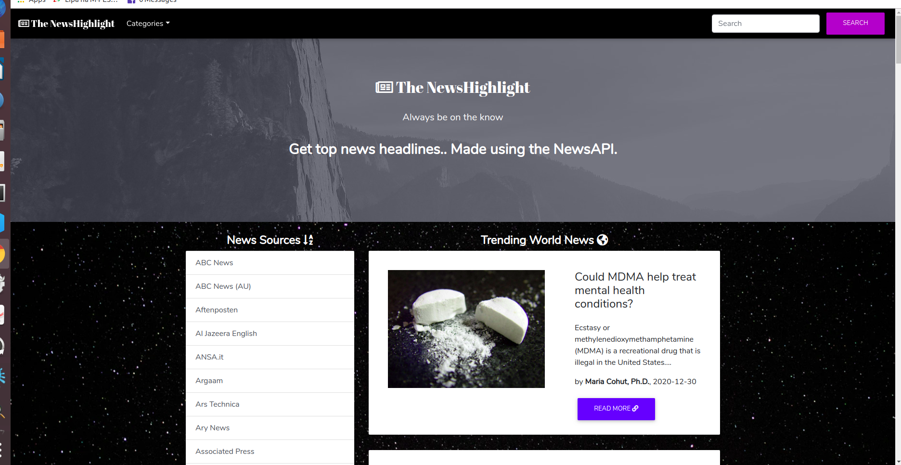

## PROJECT NAME 
 **The NewsHighlight**

 

 # DESCRIPTION

This is a Python-Flask Application that makes use of NEWS API to fetch Latest & Trending News from Various sources. 

## User Story

- Users can see various news sources on the homepage of the application.

- Users can select a news source and see all news articles from the selected news source in the application..

- Users can see image, description and the time a news was created. 

- Users can click on an article and read the full article on the source website.

## Features
Here are the features in summary:
* A minimalistic landing page showing trending world news and a variety of news sources
* Clickable news sources which direct the user to a page with article highlights from the particular source.

## Behaviour Driven Development (BDD)
|Behaviour 	           |    Input 	                 |       Output          |
|----------------------------------------------|:-----------------------------------:|-----------------------------:|       
|Page loads, user arrives in the landing page, is greeted to a list of all available news sources.                        |  The user can click on any particulr list group item to be directed to a separate page containing news highlights curated by the same publisher.          | On clicking the "read more" button, the user is redirected to the main article to read the full story.    |   

## Requirements
* This program requires python3.+ (and pip) installed, a guide on how to install python on various platforms can be found [here](https://www.python.org/)
* Once python is installed, install the folowing external libraries provided in the requirements.txt file using pip
* Example: 
    * **`pip install flask`**

## Installation and Set-up
To view the app, open the live site link provided below on the README.
Here is a run through of how to set up the application:
* **Step 1** : Clone this repository using **`git clone https://github.com/catherine244/NewsHighlight`**, or downloading a ZIP file of the code.
* **Step 2** : The repository, if downloaded as a .zip file will need to be extracted to your preferred location and opened
* **Step 3** : Go to the project root directory and install the virtualenv library using pip an afterwards create a virtual environment. Run the following commands respectively:
    * **`pip install virtualenv`**
    * **`virtualenv venv`**
    * **`source venv/bin/activate`**
        * Note that you can exit the virtual environment by running the command **`deactivate`**
* **Step 4** : Download the all dependencies in the requirements.txt using **`pip install <name>`**
* **Step 5** : Go to the [news API]() WEBSITE, sign up for a free account and generate an API key. 
    * Create a file in your root directory called start.sh and store the API key like so **`export API_KEY="<your-key>"` add your SECRET KEY**
    * On the same file write down the command **`python3 manage.py server`** 
* **Step 6** : On your terminal, run the following command, **`chmod a+x start.sh`**
    * You can now launch the application locally by running the command **`./start.sh`** 
    * Open your preferred browser and view the app by opening the link **http://127.0.0.1:5000/**.

## Technologies Used
* Python3.6
* HTML  
* CSS
* Animate.css
* MDB 4.8.10

## Contacts 
**ccayreen24@gmail.com**